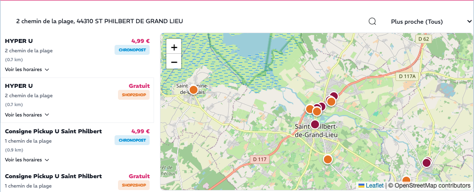
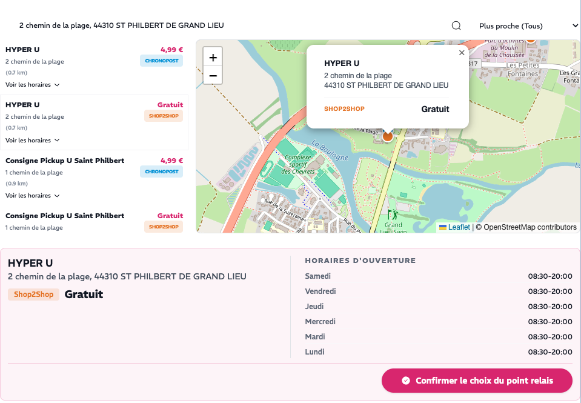
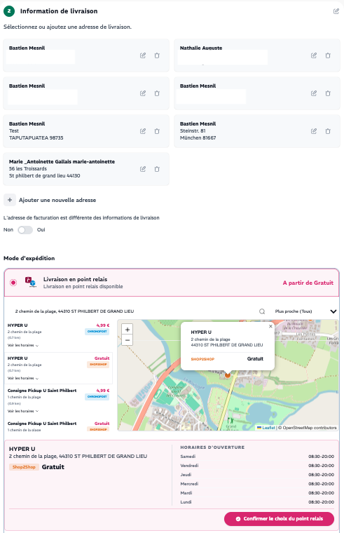

# Sylius Relay Point Plugin

[](https://github.com/BastienMesnil/sylius-relay-point-plugin/actions/workflows/ci.yml)
[](https://www.php.net)
[](LICENSE)

Carrier-agnostic relay point ("point relais") selection for the Sylius 2.x checkout.

Any carrier — French or international — plugs in by implementing a single PHP interface. Geocoding is equally swappable: Addok (French BAN, default, no API key), Nominatim, Google Maps, or Photon.

---

## Screenshots

| List + map | Point selected | Checkout context |
|:---:|:---:|:---:|
|  |  |  |

---

## Features

- **Carrier-agnostic** — implement `RelayPointProviderInterface` to add any carrier without touching the plugin core
- **Geocoding-agnostic** — switch between Addok, Nominatim, Google Maps, Photon, or your own backend via config
- **Built-in providers** — Mondial Relay, Chronopost, Shop2Shop, Colissimo, InPost, GLS, DPD, DHL, Packeta, PostNL, bpost (skeleton), Colis Privé (skeleton)
- **Auto-injected checkout hook** — appears automatically in `sylius_shop.checkout.select_shipping` via Twig Hooks, no template edit required
- **Checkout UX** — Stimulus controller + Leaflet map, embeddable in any Sylius checkout template
- **Session persistence** — selected relay point stored in session, readable server-side during checkout completion
- **Built-in order subscriber** — optional subscriber copies the relay point into the Sylius shipping address at checkout completion

---

## Requirements

- PHP 8.2+
- Sylius 2.0+
- Symfony 7.4+
- `ext-soap` (for SOAP-based carriers: Mondial Relay, Chronopost, Colissimo, Colis Privé)
- `symfony/http-client` (for REST-based providers: InPost, GLS, DPD, DHL, Packeta, PostNL)

---

## Installation

```bash
composer require keirontw/sylius-relay-point-plugin
```

Register the plugin in `config/bundles.php`:

```php
return [
    // ...
    Keirontw\SyliusRelayPointPlugin\KeirontwSyliusRelayPointPlugin::class => ['all' => true],
];
```

Import plugin routes in `config/routes.yaml`:

```yaml
keirontw_sylius_relay_point_shop:
    resource: "@KeirontwSyliusRelayPointPlugin/config/routes/shop.yaml"
```

---

## Configuration

Create `config/packages/keirontw_sylius_relay_point.yaml`:

```yaml
keirontw_sylius_relay_point:

    # ── Widget UI ────────────────────────────────────────────────────────────
    # CSS framework used to render the relay point picker widget.
    #   tailwind  — default, matches the Sylius Shop theme shipped since 2.0
    #   bootstrap — pick this if your shop theme is still on Bootstrap 4/5
    # See "Customising the widget → CSS framework" below for details.
    ui:
        theme: tailwind

    # ── Geocoding ─────────────────────────────────────────────────────────────
    geocoding:
        # addok        — French BAN (free, no key, best for France) — default
        # nominatim    — self-hosted OSM (public nominatim.openstreetmap.org forbids SaaS use)
        # google_maps  — commercial worldwide
        # photon       — self-hosted OSM, lightweight
        # custom       — wire your own GeocodingProviderInterface alias in services.yaml
        provider: addok

        addok:
            url: 'https://api-adresse.data.gouv.fr/search/'   # or your self-hosted Addok

        nominatim:
            url: 'https://your-nominatim.example.com/search'
            user_agent: 'MyShop (contact@myshop.com)'
            contact_email: 'contact@myshop.com'

        google_maps:
            api_key: '%env(GOOGLE_MAPS_API_KEY)%'

        photon:
            url: 'https://your-photon.example.com/api'
            lang: fr

    # ── Order subscriber ──────────────────────────────────────────────────────
    # When true, the plugin automatically copies the relay point (street, postcode,
    # city, countryCode, company name) into the Sylius shipping address upon
    # checkout completion and clears the session entry.
    apply_relay_point_to_order: true   # default: true

    # ── Carrier providers ─────────────────────────────────────────────────────
    providers:

        mondial_relay:
            enabled: true
            account:  '%env(MONDIAL_RELAY_ACCOUNT)%'
            password: '%env(MONDIAL_RELAY_PASSWORD)%'
            shipping_method_codes:
                - mondial_relay_france
                - mondial_relay_belgium

        chronopost:
            enabled: true
            account:  '%env(CHRONOPOST_ACCOUNT)%'
            password: '%env(CHRONOPOST_PASSWORD)%'
            shipping_method_codes:
                - chronopost_pickup_france

        shop2shop:
            enabled: true
            account:  '%env(SHOP2SHOP_ACCOUNT)%'
            password: '%env(SHOP2SHOP_PASSWORD)%'
            shipping_method_codes:
                - shop2shop_france

        colissimo:
            enabled: true
            account_number: '%env(COLISSIMO_ACCOUNT)%'
            password:       '%env(COLISSIMO_PASSWORD)%'
            filter_relay: 'A'   # A=all, P=relay points only, C=lockers only
            shipping_method_codes:
                - colissimo_pickup_france

        inpost:
            enabled: true
            # Country-specific endpoints:
            #   France:  https://api.inpost.fr/v1/points
            #   Poland:  https://api-pl-points.easypack24.net/v1/points
            #   UK:      https://api.inpost.co.uk/v1/points
            base_url: 'https://api.inpost.fr/v1/points'
            shipping_method_codes:
                - inpost_france

        dpd:
            enabled: true
            # API key: https://developer.dpd.com (free, covers all EU countries)
            api_key: '%env(DPD_API_KEY)%'
            shipping_method_codes:
                - dpd_pickup_france
                - dpd_pickup_germany
                - dpd_pickup_belgium

        dhl:
            enabled: true
            # API key: https://developer.dhl.com (free)
            api_key: '%env(DHL_API_KEY)%'
            # parcel:pick-up     → DHL ServicePoints
            # parcel:drop-off-easy → DHL Packstations (Germany)
            service_type: 'parcel:pick-up'
            shipping_method_codes:
                - dhl_servicepoint_france
                - dhl_servicepoint_germany

        packeta:
            enabled: true
            # API key: https://client.packeta.com (free for merchants)
            # Covers: CZ, SK, PL, HU, RO, DE, AT, FR, IT, ES, BE and more
            api_key: '%env(PACKETA_API_KEY)%'
            shipping_method_codes:
                - packeta_czech_republic
                - packeta_slovakia
                - packeta_poland

        post_nl:
            enabled: true
            # API key: https://developer.postnl.nl (business account required)
            # Covers: NL, BE and more
            api_key: '%env(POSTNL_API_KEY)%'
            # PG=retail points + lockers (default), PA=lockers only, PG_EX=retail only
            delivery_options: 'PG'
            shipping_method_codes:
                - postnl_netherlands
                - postnl_belgium

        gls:
            enabled: true
            # Credentials provided by your GLS contact upon account setup
            username: '%env(GLS_USERNAME)%'
            password: '%env(GLS_PASSWORD)%'
            # base_url: 'https://shipit.gls-group.eu/backend/rs/parcelshop'  # default
            shipping_method_codes:
                - gls_france
                - gls_germany
                - gls_belgium

        bpost:
            enabled: false   # See note — no public API, requires bpost business agreement
            api_key:  '%env(BPOST_API_KEY)%'
            base_url: '%env(BPOST_API_BASE_URL)%'
            shipping_method_codes:
                - bpost_belgium

        colis_prive:
            enabled: false   # See note — relay point WSDL must be confirmed with Colis Privé
            login:    '%env(COLIS_PRIVE_LOGIN)%'
            password: '%env(COLIS_PRIVE_PASSWORD)%'
            shipping_method_codes:
                - colis_prive_relay
```

> **bpost:** bpost does not expose a public API for parcel point search. Access requires a verified business partner agreement via the OSP portal. Contact bpost at https://www.bpost.be/en/business. The `BpostProvider` skeleton is ready and only needs the correct endpoint and field mapping once credentials are obtained.

> **Colis Privé:** the relay point search WSDL URL and method name must be confirmed with Colis Privé technical support before enabling this provider. The `ColisPriveRelayProvider` skeleton is ready.

---

## Checkout integration

### Automatic Twig Hook (recommended)

The plugin auto-registers itself in the `sylius_shop.checkout.select_shipping` hook via `PrependExtensionInterface`. No template changes are required — the widget appears automatically when the customer selects a shipping method whose code is listed in `shipping_method_codes`.

Override the hook priority if needed:

```yaml
# config/packages/sylius_twig_hooks.yaml
sylius_twig_hooks:
    hooks:
        'sylius_shop.checkout.select_shipping':
            relay_point_picker:
                priority: 150   # move above the form
```

### Manual embed (alternative)

For custom checkout flows that do not use Twig Hooks:

```twig
{# Show only when the active shipment uses a relay method #}


    {% include '@KeirontwSyliusRelayPointPlugin/shop/relay_point_picker.html.twig' with {
        searchUrl:       path('keirontw_relay_point_shop_search'),
        geocodeUrl:      path('keirontw_relay_point_shop_geocode'),
        selectUrl:       path('keirontw_relay_point_shop_select'),
        methodCodes:     [active_method_code],
        cartToken:       cart.tokenValue,
        addressStreet:   cart.shippingAddress.street,
        addressCity:     cart.shippingAddress.city,
        addressPostcode: cart.shippingAddress.postcode,
        addressCountry:  cart.shippingAddress.countryCode,
    } %}

```

### Register the Stimulus controller

Install the npm package:

```bash
npm install @keirontw/sylius-relay-point-plugin
```

Add the entry to your `assets/controllers.json`:

```json
{
    "controllers": {
        "@keirontw/sylius-relay-point-plugin": {
            "relay-point-picker": {
                "enabled": true,
                "fetch": "eager"
            }
        }
    }
}
```

**Without npm:** copy `assets/shop/controllers/relay-point-picker_controller.js` into your project's `assets/controllers/` and import it in your entrypoint.

### Widget events

The Stimulus controller dispatches events that bubble to `window`:

| Event | When | `event.detail` |
|---|---|---|
| `relay-point-picker:selected` | Customer clicks a point in the list or map | `{ point }` |
| `relay-point-picker:confirmed` | Customer clicks "Confirm" | `{ point }` |
| `relay-point-picker:error` | Network or API error | `{ message }` |

When `selectUrl` is provided, the plugin automatically POSTs to the session on confirm. Listen to `relay-point-picker:confirmed` in your Stimulus controller to trigger the next checkout step:

```js
// assets/controllers/checkout_controller.js
import { Controller } from '@hotwired/stimulus';

export default class extends Controller {
    connect() {
        this.element.addEventListener('relay-point-picker:confirmed', this.#onConfirmed.bind(this));
    }

    #onConfirmed(event) {
        // Submit the checkout form, redirect, update hidden field…
        this.element.querySelector('form').submit();
    }
}
```

Handle errors from the widget:

```js
window.addEventListener('relay-point-picker:error', (event) => {
    // Display a toast, banner, etc.
    showToast(event.detail.message);
});
```

### Order completion — built-in subscriber

When `apply_relay_point_to_order: true` (the default), the plugin registers `RelayPointOrderSubscriber` which:

1. Runs on the Sylius order completion event
2. Reads `RelayPointSessionStorage::get($order->getTokenValue())`
3. If a relay point is found, updates the shipping address (street, postcode, city, countryCode, company = relay point name)
4. Clears the session entry

No code change is needed. To **disable** it:

```yaml
keirontw_sylius_relay_point:
    apply_relay_point_to_order: false
```

To **extend** the behaviour (e.g. store the relay point ID on a custom entity field), disable the built-in subscriber and write your own:

```php
use Keirontw\SyliusRelayPointPlugin\RelayPoint\RelayPointSessionStorage;
use Symfony\Component\EventDispatcher\Attribute\AsEventListener;

#[AsEventListener(event: 'sylius.order.pre_complete')]
final class ApplyRelayPointSubscriber
{
    public function __construct(
        private readonly RelayPointSessionStorage $storage,
    ) {}

    public function __invoke(GenericEvent $event): void
    {
        $order = $event->getSubject();
        $point = $this->storage->get($order->getTokenValue());

        if (null === $point) {
            return;
        }

        $address = $order->getShippingAddress();
        $address->setStreet($point->street);
        $address->setPostcode($point->postcode);
        $address->setCity($point->city);
        $address->setCountryCode($point->countryCode);
        $address->setCompany($point->name);

        // Your custom field:
        $address->setRelayPointId($point->id);

        $this->storage->clear($order->getTokenValue());
    }
}
```

---

## Customising the widget

### CSS framework (Tailwind or Bootstrap)

The widget ships with a Tailwind-based layout by default, but the classes are not hardcoded in the template: every element resolves its class list through the `relay_ui_class()` Twig function, backed by `Keirontw\SyliusRelayPointPlugin\Ui\RelayPointUiClasses`. If your Sylius shop theme is still on Bootstrap, switch the theme in config — no template change needed:

```yaml
# config/packages/keirontw_sylius_relay_point.yaml
keirontw_sylius_relay_point:
    ui:
        theme: bootstrap   # tailwind (default) | bootstrap
```

This also covers the HTML the widget generates client-side (list items, the Leaflet popup, the carrier filter, opening hours). The Stimulus controller receives the active theme via `data-relay-point-picker-theme-value` and resolves the same semantic keys against its own `UI_CLASSES` map (`assets/shop/controllers/relay-point-picker_controller.js`) — the two class maps are kept manually in sync, so if you add a new element to the template, mirror the key in both `RelayPointUiClasses` and `UI_CLASSES`.

CSS variables (below) remain the recommended way to adjust colors/radius on either theme — you don't need to touch the class maps for a simple palette change.

### CSS variables (theming — no Twig change needed)

All CSS is scoped to `.relay-picker`. Override the custom properties in your stylesheet:

```css
.relay-picker {
    --relay-primary:        #7c3aed;   /* accent / confirm button */
    --relay-primary-hover:  #6d28d9;
    --relay-primary-bg:     #f5f3ff;   /* selected-point panel background */
    --relay-primary-border: #ddd6fe;   /* selected-point panel border */
    --relay-radius:         0.375rem;  /* border-radius for panels and inputs */
    --relay-border:         #d1d5db;   /* general border color */
}
```

### Twig blocks (structural overrides — via ``)

Use `` to override individual sections without duplicating the whole template:

```twig

    
        <button type="button"
            data-action="click->relay-point-picker#confirmSelection"
            class="btn btn-primary w-full">
            Valider ce point relais
        </button>
    

```

Available blocks:

| Block | Contains |
|---|---|
| `relay_styles` | `<style>` tag with CSS variable defaults |
| `relay_search_bar` | Search input, submit button, sort control |
| `relay_filter` | Carrier filter (hidden when only one carrier) |
| `relay_grid` | Two-column map + list layout |
| `relay_list` | Scrollable relay point list |
| `relay_map` | Leaflet map container |
| `relay_selected_summary` | Selected point detail panel |
| `relay_confirm_button` | Confirm CTA inside the summary panel |

### Full template override

Copy the template to your bundle override path — Symfony will use it automatically:

```
templates/bundles/KeirontwSyliusRelayPointPlugin/shop/relay_point_picker.html.twig
```

---

## Adding a custom carrier

Implement `RelayPointProviderInterface` and tag the service. No YAML mapping needed — autoconfiguration applies the tag via `_instanceof`.

```php
use Keirontw\SyliusRelayPointPlugin\RelayPoint\RelayPointProviderInterface;
use Keirontw\SyliusRelayPointPlugin\RelayPoint\Model\RelayPoint;
use Keirontw\SyliusRelayPointPlugin\RelayPoint\Model\RelayPointSearchCriteria;

final class MyCarrierProvider implements RelayPointProviderInterface
{
    public function __construct(
        private readonly string $apiKey,
        /** @param list<string> $shippingMethodCodes */
        private readonly array $shippingMethodCodes,
    ) {}

    public function supports(string $shippingMethodCode): bool
    {
        return in_array($shippingMethodCode, $this->shippingMethodCodes, true);
    }

    /** @return RelayPoint[] */
    public function search(RelayPointSearchCriteria $criteria): array
    {
        // Call your carrier's API and map results to RelayPoint DTOs
        return [];
    }
}
```

```yaml
# config/services.yaml
App\Shipping\MyCarrierProvider:
    arguments:
        $apiKey: '%env(MY_CARRIER_API_KEY)%'
        $shippingMethodCodes: ['my_carrier_france']
```

The provider is immediately visible in the registry — no further config needed.

---

## Adding a custom geocoding provider

```php
use Keirontw\SyliusRelayPointPlugin\Geocoding\GeocodingProviderInterface;
use Keirontw\SyliusRelayPointPlugin\Geocoding\Model\GeocodingResult;

final class MyGeocoder implements GeocodingProviderInterface
{
    public function geocode(string $query): ?GeocodingResult
    {
        // ...
        return new GeocodingResult(
            latitude: 48.8,
            longitude: 2.3,
            postcode: '75001',
            city: 'Paris',
            countryCode: 'FR',
        );
    }
}
```

```yaml
# config/packages/keirontw_sylius_relay_point.yaml
keirontw_sylius_relay_point:
    geocoding:
        provider: custom

# config/services.yaml
Keirontw\SyliusRelayPointPlugin\Geocoding\GeocodingProviderInterface:
    alias: App\Geocoding\MyGeocoder
```

---

## Troubleshooting

**Widget does not appear at checkout**
- Verify that the customer's shipping method code is listed in `shipping_method_codes` for at least one provider.
- If you use the Twig Hook, confirm that `sylius_twig_hooks` extension is active. Run `bin/console debug:config sylius_twig_hooks` and look for `relay_point_picker` in the hook.
- Call `{{ relay_method_codes() }}` in a template to dump all registered codes.

**Geocode returns no result / map is blank**
- The Addok endpoint (French BAN) only understands French addresses. Switch to Nominatim or Google Maps for non-French addresses.
- The widget dispatches `relay-point-picker:error` with the error message — attach a listener to surface it in the UI.

**Search returns an empty list**
- Check the credentials for the carrier (log level `error` in the channel `keirontw_relay_point`).
- Verify the radius (`radius` query param, default 10 000 m) is large enough for the queried area.
- Confirm the country code matches what the provider supports (e.g. GLS uses two-letter ISO codes in uppercase).

**Relay point not saved to the order**
- Make sure `apply_relay_point_to_order: true` (default).
- Confirm `selectUrl` is passed to the widget and that the POST succeeds (check Network tab — expect `{"success":true}`).
- The subscriber reads the session via cart token: `cartToken` must match `order.tokenValue`.

---

## Licence

MIT. See [LICENSE](LICENSE).
